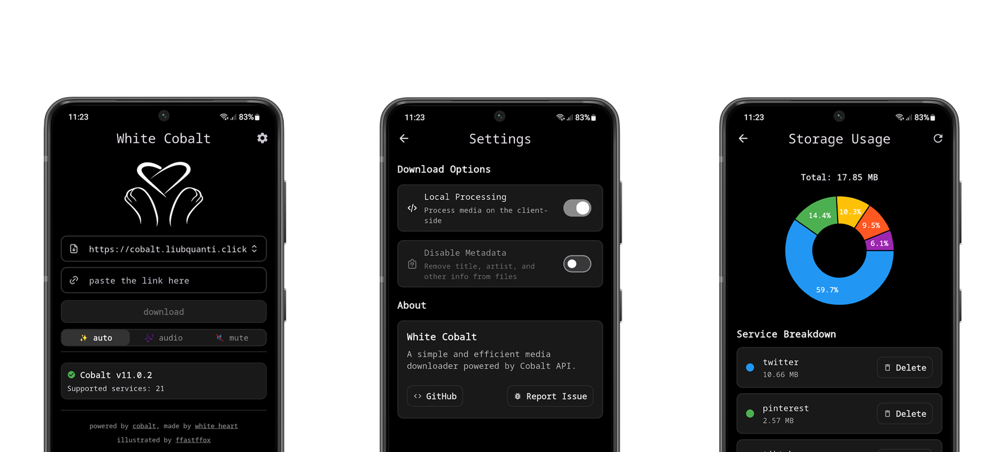

# 😺 • White Cobalt

A native Android client for downloading media from the Internet using [cobalt server APIs](https://github.com/imputnet/cobalt/blob/main/docs/api.md).

White Cobalt follows the principles of [cobalt.tools](https://cobalt.tools/):

- `No ads, trackers, paywalls, or other nonsense.`
- `Was created for public benefit.`
- `Paste the link, get the file, move on. that simple, just how it should be.`

White Cobalt is a tool that makes downloading public content easier. It takes zero liability. The end user is responsible for what they download, how they use and distribute that content.

White Cobalt is in no way a piracy tool and cannot be used as such. It can only download free & publicly accessible content.

White Cobalt was developed independently of the [creators of cobalt.tools](https://github.com/imputnet).

> 
>
> The app has not been released yet and is currently undergoing closed testing on Google Play. To join the closed testing, you must provide your email address by filling out [this form](https://forms.gle/gmNEyRK8rhmgUgG99). Then wait until you are added to the list of testers and accept [the invitation](https://play.google.com/apps/testing/liubquanti.white.cobalt). After that, you will be able to download the app from [Google Play](https://play.google.com/store/apps/details?id=liubquanti.white.cobalt).

## ⭐ • Sources

- [cobalt official website](https://cobalt.tools/).
- [cobalt API documentation](https://github.com/imputnet/cobalt/blob/main/docs/api.md).

## 🧬 • Features

- [X] Connect to a cobalt server.
- [X] Save servers for future use.
- [X] Add an API key to a server.
- [X] Check the functionality of a cobalt server.
- [X] Download media via pasted link.
- [X] Automaticly paste link from clipboard.
- [X] Download media via link shared through the share menu.
- [X] Choose between automatic, sound only and silent download method.
- [X] Switch between server and local-side processing.
- [X] Disable metadata for downloads.
- [X] Monitor how much storage space is taken up by downloaded media.
- [X] Organising downloaded media by file type.
- [X] Organising downloaded media by service.
- [X] Storage cleaning by service.

## 🧩 • Usage

There are two ways to download media:

> Open the app, paste the media link into the input field, and tap the `download` button.

> While viewing content, share the link through the share menu and select White Cobalt.

## ✅ • Supported Services

The list of supported services depends on which services are supported by the cobalt server the client is connected to. You can view the full list of supported services by the latest version of the cobalt API on the [official website](https://cobalt.tools/).

## 📊 • Development Stats

